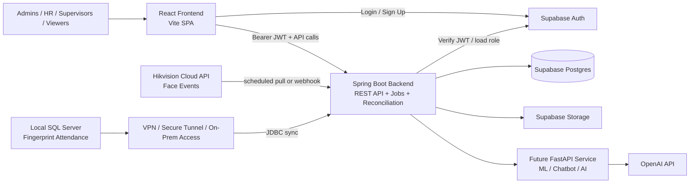
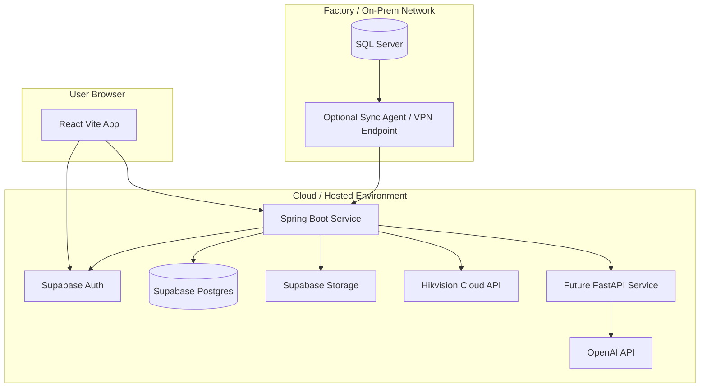
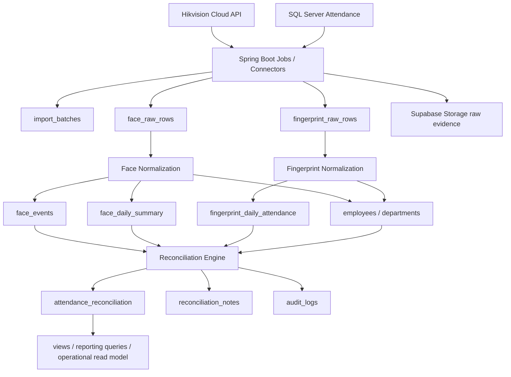
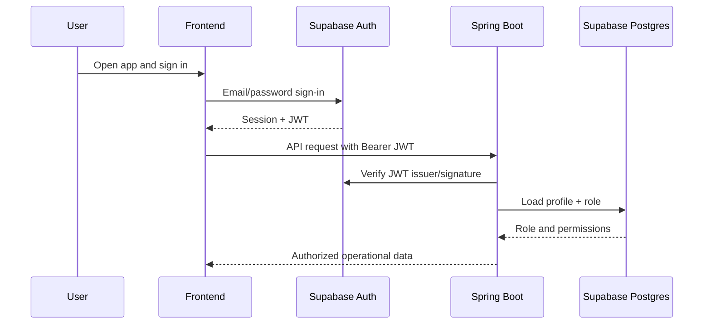
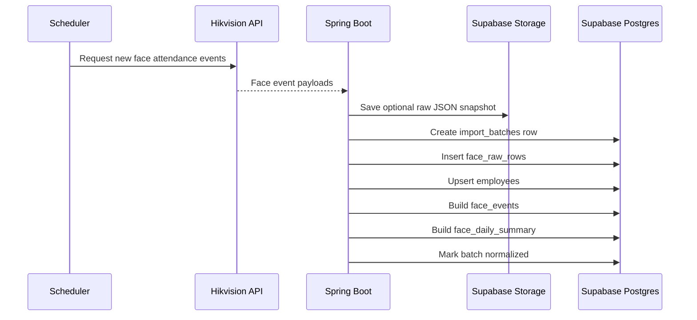
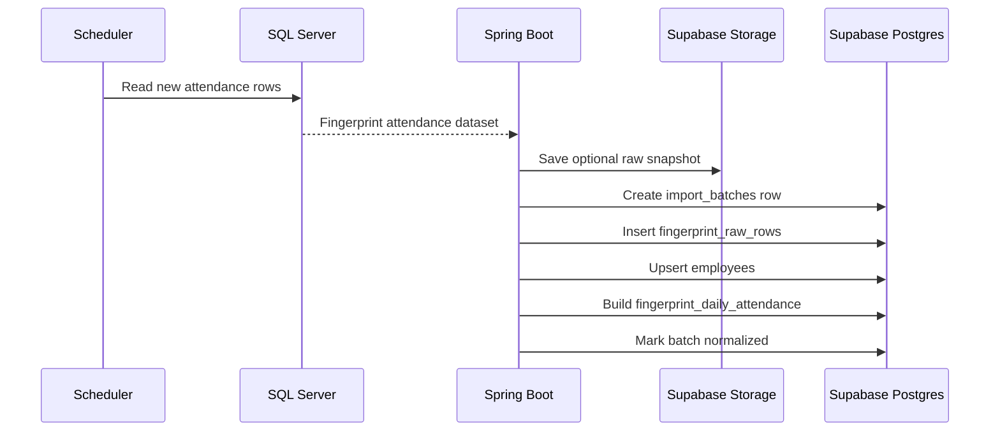
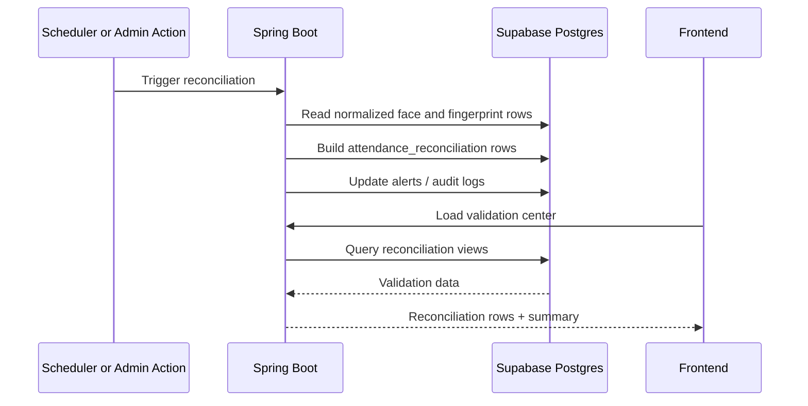
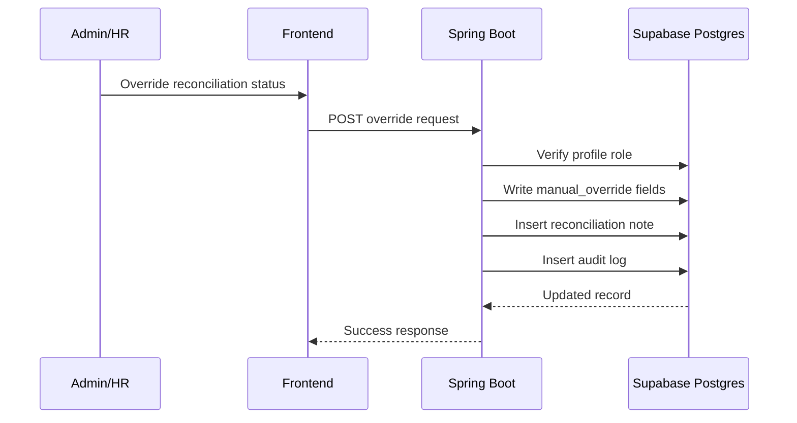
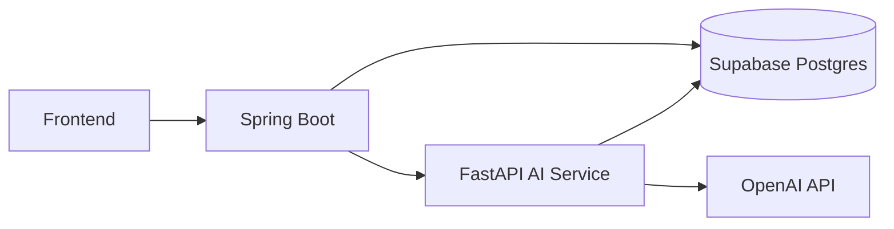

# GarmentLine Solution Architecture

This document describes the target architecture for **GarmentLine - Operations Centre** as a:

- `React / Vite frontend`
- `Spring Boot backend`
- `Supabase platform` for `Postgres + Auth + Storage`
- `Hikvision cloud API` for face-recognition attendance source data
- `local SQL Server` for fingerprint attendance source data
- `FastAPI` later for ML, anomaly scoring, and chatbot capabilities

It is written to match the current repository direction while also describing the production-ready target state.

## 1. Architecture Summary

The system should be operated as a layered operations platform:

1. `Source ingestion layer`
2. `raw audit storage layer`
3. `normalization layer`
4. `reconciliation layer`
5. `reporting and operational read-model layer`
6. `frontend interaction layer`

The most important architectural decision is:

- the browser should **not** own the attendance pipeline
- Spring Boot should own all privileged ingestion, parsing, normalization, reconciliation, scheduling, and reporting orchestration
- Supabase should remain the managed data platform underneath that backend

## 2. High-Level Context Diagram



## 3. Deployment Diagram



## 4. Core Component Responsibilities

| Component | Responsibility |
|---|---|
| `React frontend` | Role-based UI, validation workflows, import center, reports, line operations, worker views |
| `Spring Boot backend` | API layer, source connectors, privileged writes, schedulers, normalization, reconciliation orchestration |
| `Supabase Auth` | User authentication, JWT issuance, session lifecycle |
| `public.profiles` | Application roles and access control metadata |
| `Supabase Postgres` | Operational schema, raw staging, normalized records, reconciliation, audit history, reporting views |
| `Supabase Storage` | Import snapshots, source files, reprocessing inputs, evidence retention |
| `Hikvision cloud API connector` | Pull or receive face attendance event data from Hikvision |
| `SQL Server connector` | Read fingerprint attendance summaries or punch rows from the local factory system |
| `Future FastAPI service` | ML inference, anomaly scoring, embeddings, smart summaries, chatbot orchestration |

## 5. Spring Boot Backend Module Map

The current backend packages already establish a good base:

### Current modules in this repo

| Package | Current responsibility |
|---|---|
| `com.garmentline.operations.api` | REST controllers |
| `com.garmentline.operations.config` | security, CORS, Supabase configuration |
| `com.garmentline.operations.security` | authenticated user resolution and role guards |
| `com.garmentline.operations.service` | import, validation, parsing support, app-user directory logic |
| `com.garmentline.operations.supabase` | Supabase admin client |
| `com.garmentline.operations.support` | JSON helpers, exception handling |

### Recommended target module expansion

```text
backend/src/main/java/com/garmentline/operations/
  api/
    AuthController
    ImportController
    ValidationController
    ReportsController
    WorkersController
    LinesController
    AlertsController
    SettingsController
    DirectoryController

  config/
    SecurityConfig
    CorsProperties
    SupabaseProperties
    SqlServerProperties
    HikvisionProperties

  security/
    AuthenticatedUser
    UserContextService
    RoleGuard
    JwtRoleResolver

  integrations/
    hikvision/
      HikvisionClient
      HikvisionFaceSyncService
      HikvisionWebhookController
    sqlserver/
      SqlServerAttendanceReader
      SqlServerSyncService

  ingestion/
    ImportBatchOrchestrator
    RawRowWriter
    StorageSnapshotService

  normalization/
    FaceNormalizationService
    FingerprintNormalizationService
    EmployeeSyncService

  reconciliation/
    ReconciliationService
    OverrideService
    ExceptionClassificationService

  reporting/
    ValidationReportingService
    AttendanceReportingService
    DepartmentSummaryService

  operations/
    WorkerOperationsService
    LineAssignmentService
    AlertService
    SettingsService

  scheduler/
    HikvisionSyncJob
    SqlServerSyncJob
    ReconciliationJob
    RetryFailedBatchJob

  supabase/
    SupabaseAdminClient
    SupabaseStorageClient

  support/
    ApiException
    ApiExceptionHandler
    JsonSupport
    TimeRangeSupport
    AuditSupport
```

## 6. Frontend Responsibilities

The frontend should stay operationally focused and lightweight:

- render the current operational screens
- authenticate with Supabase Auth
- send the Supabase JWT to Spring Boot
- show live import status, validation queues, reports, line state, and worker detail
- never directly talk to Hikvision or SQL Server
- never hold service-role credentials

### Frontend data strategy

The frontend should progressively move to:

- `GET/POST` Spring Boot APIs for operational actions
- optional direct `supabase-js` only for auth/session if you keep auth login in-browser

This keeps business logic server-side and prevents the browser from owning ingestion rules.

## 7. Source Integration Design

### 7.1 Hikvision cloud API source

Source characteristics:

- cloud-hosted face-recognition attendance source
- event-based source
- can produce multiple timestamps per employee per day
- should be treated as face event truth, not final attendance status

Recommended integration:

1. Spring Boot scheduler polls Hikvision API every few minutes, or receives webhooks if Hikvision supports them.
2. Each API response is written into:
   - `import_batches`
   - `face_raw_rows`
   - optional raw JSON evidence in `Supabase Storage`
3. Raw events are normalized into:
   - `face_events`
   - `face_daily_summary`
4. Employee master records are synced by canonical `employee_code`.

### 7.2 Local SQL Server fingerprint source

Source characteristics:

- located inside factory/on-prem network
- may contain attendance summary rows or punch-level data
- may require secure network path to access from cloud-hosted backend

Recommended integration:

1. Spring Boot connects over:
   - site-to-site VPN, or
   - secure tunnel, or
   - lightweight on-prem sync agent
2. Scheduler reads new or changed attendance rows from SQL Server.
3. Spring Boot persists:
   - `import_batches`
   - `fingerprint_raw_rows`
   - optional CSV/JSON export snapshot into storage
4. Raw rows normalize into:
   - `fingerprint_daily_attendance`

If direct cloud-to-factory database access is not acceptable, the preferred fallback is an on-prem sync worker that pushes sanitized attendance rows to Spring Boot.

## 8. Data Pipeline Diagram



## 9. Database Logic Layers

The schema is intentionally split into layers instead of one “attendance” table.

### Layer 1: identity and access

- `auth.users`
- `public.profiles`

### Layer 2: master/reference data

- `employees`
- `departments`
- `leave_code_map`

### Layer 3: import and audit control

- `import_batches`
- storage paths in the `imports` bucket

### Layer 4: raw staging

- `face_raw_rows`
- `fingerprint_raw_rows`

### Layer 5: normalized source truth

- `face_events`
- `face_daily_summary`
- `fingerprint_daily_attendance`

### Layer 6: reconciled operational truth

- `attendance_reconciliation`
- `reconciliation_notes`
- `audit_logs`

### Layer 7: wider operational screens

- `production_lines`
- `employee_profiles`
- `line_assignments`
- `transfer_logs`
- `operations_alerts`
- `operations_alert_history`
- `system_settings`
- `announcements`
- `incentive_records`
- `production_line_daily_metrics`

## 10. Normalization and Reconciliation Logic

### Face normalization

The Hikvision face source is treated as an event stream:

- preserve every raw event for audit
- validate and normalize timestamps
- build a daily summary:
  - first seen
  - last seen
  - event count
  - duplicates
  - quality flags

### Fingerprint normalization

The SQL Server fingerprint source is treated as processed attendance input:

- preserve the raw source row
- parse time-in, time-out, OT, leave values
- classify attendance state:
  - `present`
  - `leave`
  - `absent`
  - `review`
  - `no_data`

### Reconciliation

The reconciliation key is:

- `employee_code + attendance_date`

The engine combines face summary and fingerprint attendance into:

- `validated`
- `face_only`
- `fingerprint_only`
- `leave`
- `absent`
- `needs_review`
- `anomaly`

That result becomes the main dataset used by:

- Validation Center
- attendance reports
- alerts
- worker exception views
- smart summary features later

## 11. Runtime Sequence Diagrams

### 11.1 User login and secure data access



### 11.2 Scheduled Hikvision face sync



### 11.3 Scheduled SQL Server fingerprint sync



### 11.4 Reconciliation and validation flow



### 11.5 Manual override flow



## 12. Spring API Surface

The API should be grouped by business capability rather than table.

### Auth-aware session/profile APIs

- `GET /api/me`
- `GET /api/app-users`

### Import and ingestion APIs

- `GET /api/import-batches`
- `POST /api/import-batches/upload`
- `POST /api/import-batches/{id}/normalize`
- `POST /api/import-batches/{id}/retry`

### Reconciliation and validation APIs

- `GET /api/reconciliation`
- `GET /api/reconciliation/summary`
- `GET /api/reconciliation/{id}`
- `POST /api/reconciliation/pairs`
- `POST /api/reconciliation/{id}/override`
- `POST /api/reconciliation/{id}/notes`

### Operations APIs

- `GET /api/dashboard`
- `GET /api/workers`
- `GET /api/workers/{id}`
- `GET /api/production-lines`
- `POST /api/line-assignments`
- `POST /api/transfers`
- `GET /api/alerts`
- `PATCH /api/alerts/{id}`
- `GET /api/settings`
- `PATCH /api/settings`

### Reporting APIs

- `GET /api/reports/validation`
- `GET /api/reports/exceptions`
- `GET /api/reports/attendance`
- `GET /api/reports/departments`

## 13. Networking and Security

### Authentication and authorization

- users authenticate via Supabase Auth
- browser receives JWT
- browser sends JWT to Spring Boot
- Spring Boot verifies the token and resolves role from `public.profiles`

### Access control

- `admin`: full access
- `hr`: imports, validation, reports, overrides
- `supervisor`: line operations, validation read, alerts
- `viewer`: read-only reporting and monitoring

### Secret handling

- frontend must never see the Supabase service role key
- frontend must never directly access Hikvision or SQL Server
- Spring Boot stores integration credentials securely through environment variables or a secret manager

### SQL Server connectivity

Preferred options:

1. secure VPN between cloud backend and factory network
2. tunnel or reverse proxy with IP allow-listing
3. on-prem sync agent if inbound DB access is restricted

## 14. Storage Strategy

Supabase Storage should be used for evidence retention and replayability.

Recommended conventions:

- `imports/face/yyyy/mm/batch-id/source.json` for Hikvision raw snapshots
- `imports/fingerprint/yyyy/mm/batch-id/source.json` or `.csv` for SQL Server exports
- `imports/manual/...` if manual upload remains supported for historical backfill

Not every automated batch must come from a user-uploaded file, but every batch should still have:

- a batch record
- a source marker
- raw evidence path if retention is enabled

## 15. Observability and Operations

The backend should log and measure:

- source sync start/end
- raw rows ingested
- normalized rows created
- reconciliation rows updated
- failed batches
- scheduler retry counts
- source latency and API/DB errors

Recommended additions:

- structured JSON logs
- Micrometer metrics
- Actuator health endpoints
- a dead-letter or retry model for failed syncs

## 16. Future FastAPI Role

FastAPI should be added later only for workloads that benefit from Python:

- anomaly scoring
- predictive attendance insights
- OCR/document extraction if a new document source appears
- embeddings and semantic retrieval
- chatbot orchestration over operational data

Recommended interaction pattern:



Spring Boot should remain the system-of-record backend even after FastAPI is introduced.

## 17. Recommended Operating Model

### Phase 1

- frontend + Spring Boot + Supabase
- manual import still available
- Spring APIs replace browser-owned pipeline logic

### Phase 2

- scheduled Hikvision API ingestion
- scheduled SQL Server ingestion
- automatic reconciliation jobs

### Phase 3

- dashboard, workers, lines, alerts fully served from Spring APIs
- stronger job retry and monitoring

### Phase 4

- FastAPI AI service
- chatbot
- anomaly detection
- smart summaries

## 18. Final Recommendation

For this project, the clean target architecture is:

- `React frontend` for UI only
- `Spring Boot backend` for business workflow and system integrations
- `Supabase` for auth, database, storage, and SQL-side reporting primitives
- `Hikvision cloud API connector` inside Spring Boot for face data
- `SQL Server connector` inside Spring Boot for fingerprint data
- `FastAPI later` only for AI-specific workloads

That architecture gives you:

- cleaner security boundaries
- auditable source-to-report flow
- retryable ingestion jobs
- explainable reconciliation
- simpler future AI expansion without replacing the core system
